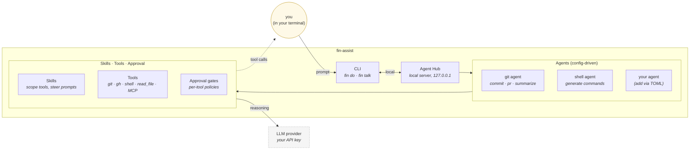

# fin-assist

**Your terminal, with AI agents that have hands.** fin-assist is a personal AI agent platform that lives in your shell. You bring agents to your work — git, shell, your codebase — instead of context-switching to a chat tab. Each agent is purpose-built for a workflow, runs locally, and uses real tools (with approval gates for the dangerous ones).

> ⚠️ Pre-release. Currently a personal-use platform; the API and config schema are still moving.

```text
$ fin do git commit
✓ git diff (auto-approved)
✓ git diff --staged (auto-approved)

  feat(skills): add per-tool approval policies

  Move approval rules from per-skill config to agent-level tool_policies,
  eliminating merge conflicts when multiple skills share a tool.

? Run 'git commit -m ...'? [y/N] y
✓ Committed.
```

## What it actually is

You run **agents** — small specialized AI workers — from your terminal. An agent is shaped by:

- **A system prompt** that defines what it's good at (git workflows, shell commands, design brainstorming)
- **Skills** it can load (a "commit" skill, a "PR" skill) that scope down what tools it has and steer how it works
- **Tools** the agent can actually call (`git`, `gh`, `read_file`, `run_shell`) — gated by approval policies you configure



A few things make this different from "yet another AI CLI":

- **Agents are TOML, not Python.** Add a new agent by editing `config.toml` — pick a system prompt, list skills, set tool approval policies. No subclassing.
- **Skills gate tools.** When you run `fin do git commit`, the agent only has the tools the `commit` skill grants. Other tools don't exist from its perspective.
- **Real approval gates.** Per-tool fnmatch rules: `git diff*` auto-approves, `git push*` always asks. You stay in control of side effects.
- **Protocol-native.** The hub speaks [A2A](https://google.github.io/A2A/) — any A2A client can connect, future agents can be in any language.
- **Local-first.** The hub binds to `127.0.0.1`. Your prompts and history stay on your machine.

## Getting started

**Requirements:** [`devenv`](https://devenv.sh/) (or Python 3.12+ with `uv`).

```bash
# Enter the dev shell (Nix-managed)
just dev

# Install fin-assist
uv sync

# Configure a provider (Anthropic, OpenAI, OpenRouter, Google)
fin-assist /connect

# Try it
fin-assist do "list the largest files in this repo"
fin-assist do git commit            # uses the git agent's commit skill
fin-assist talk --agent git         # multi-turn session
```

Set `FIN_DATA_DIR=./.fin` (already set in `devenv.nix` for repo dev) to keep state colocated with your project instead of `~/.local/share/fin/`.

### CLI cheat sheet

```text
fin-assist serve                        Start the agent hub
fin-assist agents                       List available agents
fin-assist do "prompt"                  One-shot to default agent
fin-assist do --agent test "prompt"     One-shot to a named agent
fin-assist do --skill commit "prompt"   One-shot with a skill pre-loaded
fin-assist do <agent> <skill>           Positional skill (e.g. fin do git commit)
fin-assist do                           Open input panel
fin-assist do --edit "prompt"           Open input panel, pre-filled
fin-assist talk                         Multi-turn session
fin-assist list tools|skills|prompts    List registry entries
```

Inside `fin do` / `fin talk`, use `@`-completion to inject context: `@file:src/foo.py`, `@git:diff`, `@git:log`, `@history:query`.

## Configuration in 30 seconds

```toml
[general]
default_agent = "git"

[agents.git]
description = "Git workflows."
system_prompt = "git"
serving_modes = ["do"]

[agents.git.skills.commit]
description = "Generate a conventional commit message from current changes."
tools = ["git"]
prompt_template = "git-commit"
entry_prompt = "Analyze the current changes and generate a conventional commit message."

[agents.git.tool_policies.git]
default = "always"
rules = [
  { pattern = "git diff*",   mode = "never" },
  { pattern = "git status*", mode = "never" },
  { pattern = "git log*",    mode = "never" },
]
```

That's it — `fin do git commit` will now use this agent. See [`docs/configuration.md`](docs/configuration.md) for the full schema and [`docs/skills.md`](docs/skills.md) for the skills authoring guide.

## Documentation

For the user perspective, this README is the front door. For internals:

- [`docs/architecture.md`](docs/architecture.md) — how the hub, agents, and backends fit together
- [`docs/configuration.md`](docs/configuration.md) — TOML schema, env vars, credentials
- [`docs/skills.md`](docs/skills.md) — skills, tool gating, approval policies, SKILL.md format
- [`docs/tracing.md`](docs/tracing.md) — OTel instrumentation and HITL trace continuity
- [`docs/decisions.md`](docs/decisions.md) — design decisions and open questions
- [`AGENTS.md`](AGENTS.md) — development workflow and conventions (for contributors)

Active work lives in [GitHub milestones](https://github.com/ColeB1722/fin-assist/milestones); ideas and discussions live in [issues](https://github.com/ColeB1722/fin-assist/issues).

## Status

Pre-release, single-developer project. Currently shipping v0.1 (Skills API). The protocol layer (A2A), hub, CLI, streaming, tool calling, HITL approval, tracing, and skills are all working. Next up: MCP integration, additional agents (SDD, TDD), and a TUI client.
