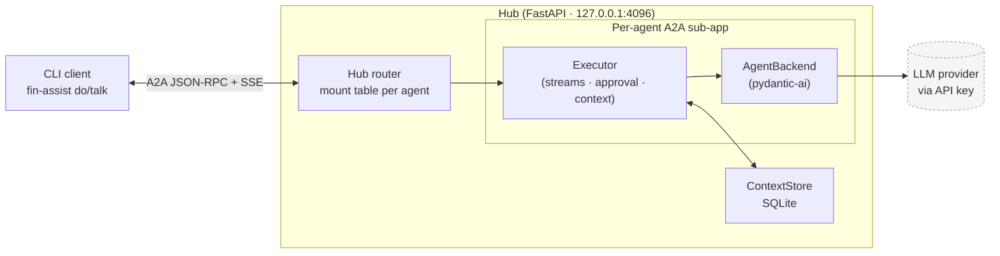

# fin-assist

Personal AI agent platform for terminal workflows. Agents, skills, and tools are defined in TOML; a local hub serves them via the [A2A protocol](https://google.github.io/A2A/); a CLI client streams responses inline. Tool calls run on the host machine and pass through configurable approval gates.

> Pre-release. The API and config schema are still moving.

## Concepts

- **Agent.** A configured combination of system prompt, output type, and capabilities. Agents are TOML entries under `[agents.<name>]`, not Python subclasses. `serving_modes` declares whether the agent supports one-shot (`do`) or multi-turn (`talk`) invocations.
- **Skill.** A scoped capability bundle within an agent: a tool list, a prompt template, and an entry prompt. Skills gate which tools the LLM can call — unloaded skills' tools are not visible to the agent. Defined under `[agents.<name>.skills.<skill>]`.
- **Tool.** A callable side-effect surface (`git`, `gh`, `read_file`, `run_shell`, MCP servers). Tools are registered into a shared registry and attached to agents via skills.
- **Tool policy.** Per-tool approval rules (`always`, `never`, fnmatch pattern rules). Defined at the agent level under `[agents.<name>.tool_policies.<tool>]` so each tool has exactly one policy regardless of how many skills reference it.
- **Hub.** Local FastAPI server (`127.0.0.1:4096` by default) that mounts each enabled agent as an A2A sub-app. The CLI is one client; any A2A-compatible client can connect.

## Example

A `git` agent with a `commit` skill — TOML config, then invocation:

```toml
# config.toml
[agents.git]
system_prompt = "git"
serving_modes = ["do"]

[agents.git.skills.commit]
description = "Generate a conventional commit message from current changes."
tools = ["git"]
prompt_template = "git-commit"
entry_prompt = "Analyze the current changes and generate a conventional commit message."

[agents.git.tool_policies.git]
default = "always"                                      # require approval by default
rules = [
  { pattern = "git diff*",   mode = "never" },          # auto-approve read-only ops
  { pattern = "git status*", mode = "never" },
  { pattern = "git log*",    mode = "never" },
]
```

```text
$ fin-assist do --agent git commit
✓ git diff             (auto-approved by tool_policies)
✓ git diff --staged    (auto-approved by tool_policies)

  feat(skills): add per-tool approval policies

  Move approval rules from per-skill config to agent-level tool_policies,
  eliminating merge conflicts when multiple skills share a tool.

? Run 'git commit -m ...'? [y/N] y    # default policy: requires approval
✓ Committed.
```

`fin-assist do --agent git commit` — `commit` is the prompt; because `commit` matches a skill on the `git` agent, it's auto-promoted to `--skill commit` (entry prompt sent, skill's tools loaded, `prompt_template` injected as system prompt).

## Architecture



One hub process serves N agents, each as its own A2A sub-app at `/agents/<name>/`. The CLI auto-starts the hub if it isn't running. See [`docs/architecture.md`](docs/architecture.md) for the full picture.

## Install

Requirements: [`devenv`](https://devenv.sh/), or Python 3.12+ with [`uv`](https://docs.astral.sh/uv/).

```bash
just dev                              # enter dev shell (Nix-managed)
uv sync                               # install dependencies

export ANTHROPIC_API_KEY=sk-...       # or OPENAI_API_KEY, OPENROUTER_API_KEY, GOOGLE_API_KEY
                                      # (interactive setup: planned, see issue #124)

fin-assist agents                     # verify install — lists configured agents
```

State (logs, hub DB, sessions, history, credentials, traces) lives under `$FIN_DATA_DIR`, default `~/.local/share/fin/`. The repo's `devenv.nix` sets `FIN_DATA_DIR=./.fin` so state is colocated with the checkout during development.

## CLI reference

```text
fin-assist serve                            Start the hub (foreground)
fin-assist start | stop | status            Background hub lifecycle
fin-assist agents                           List configured agents
fin-assist do "<prompt>"                    One-shot to default agent
fin-assist do --agent <name> "<prompt>"     One-shot to a named agent
fin-assist do --agent <name> --skill <s>    One-shot with skill pre-loaded
fin-assist do --agent <name> <skill>        Prompt-as-skill: prompt auto-promoted
                                            to skill when it matches a skill name
fin-assist do                               No prompt → opens input panel
fin-assist do --edit "<prompt>"             Opens panel pre-filled
fin-assist talk [--agent <n>] [--skill <n>] Multi-turn session
fin-assist talk --resume <id>               Resume a saved session
fin-assist talk --list                      List saved sessions
fin-assist list tools|skills|prompts|output-types
```

Inside `do` / `talk`, `@`-completion injects context inline: `@file:<path>`, `@git:diff`, `@git:log`, `@history:<query>`.

REPL commands during `talk`: `/skills` (list), `/skill:<name>` (load), `/help`, `/exit`.

## Documentation

- [`docs/architecture.md`](docs/architecture.md) — hub, agents, backends, A2A integration
- [`docs/configuration.md`](docs/configuration.md) — TOML schema, env vars, credentials
- [`docs/skills.md`](docs/skills.md) — skills, tool gating, approval policies, SKILL.md format
- [`docs/tracing.md`](docs/tracing.md) — OTel instrumentation, HITL trace continuity
- [`docs/decisions.md`](docs/decisions.md) — design decisions, open questions
- [`AGENTS.md`](AGENTS.md) — development workflow and conventions

Committed work: [GitHub milestones](https://github.com/ColeB1722/fin-assist/milestones). Discussions and ideas: [GitHub issues](https://github.com/ColeB1722/fin-assist/issues).

## Status

v0.1 (Skills API) shipped. Working: A2A protocol, hub, CLI, streaming, tool calling, HITL approval, tracing, skills. v0.1.1 in progress: MCP, per-subcommand approval, interactive credential setup.
