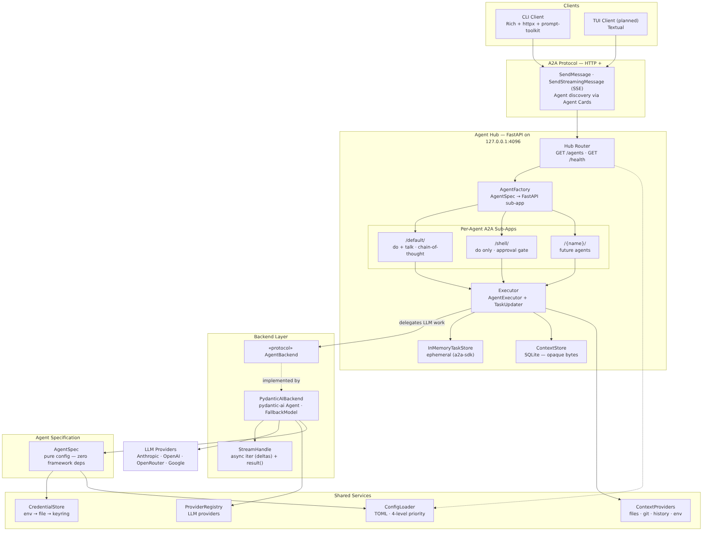
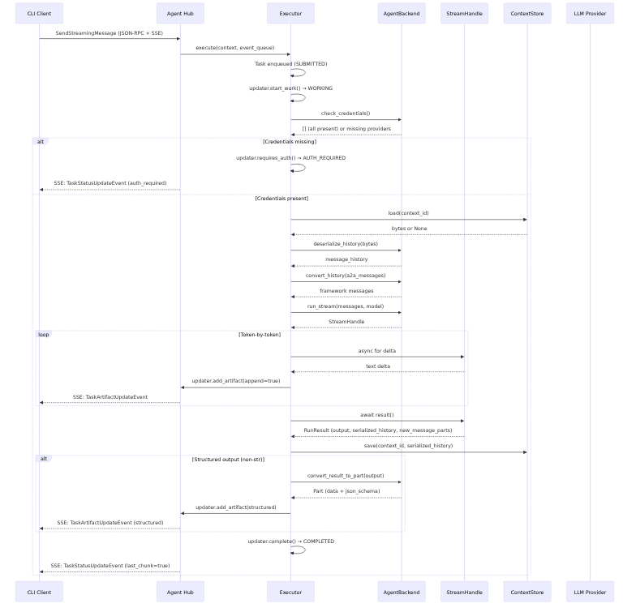

# fin-assist

Expandable personal AI agent platform for terminal workflows. An **Agent Hub** hosts N specialized agents over the [A2A protocol](https://google.github.io/A2A/) — clients dynamically adapt their UI based on each agent's declared capabilities.

## System Architecture



## Request Flow



## Key Concepts

| Concept | Implementation |
|---------|---------------|
| **Config-driven agents** | Agent behavior (prompt, output type, thinking, approval) defined in TOML — new agents are config entries, not new classes |
| **Protocol-native** | A2A via a2a-sdk v1.0; any A2A client can connect; enables future agent-to-agent workflows |
| **Multi-path routing** | N agents → N A2A sub-apps at `/agents/{name}/`, each with its own agent card |
| **Token-by-token streaming** | `SendStreamingMessage` SSE → `TaskUpdater.add_artifact(append=True)` → Rich `Live` rendering |
| **Metadata-driven UI** | Static capabilities in `AgentExtension` on agent card; dynamic hints per-response in artifact metadata |
| **Local-first** | Binds `127.0.0.1` only; no network exposure by default |

## CLI Usage

```
fin-assist serve                        Start agent hub
fin-assist agents                       List available agents
fin-assist do "prompt"                  One-shot query (default agent)
fin-assist do shell "list large files"  One-shot query (shell agent)
fin-assist talk                         Multi-turn session (default agent)
fin-assist talk shell                   Multi-turn session (shell agent)
```

## Status

| Phase | Description | Status |
|-------|-------------|--------|
| 1–7 | Repo setup → Hub server | Done |
| 8 | CLI client + REPL | Done |
| 9 | Streaming + integration tests | In progress |
| Config redesign | Config-driven agents, single `ConfigAgent` class | Done |
| a2a-sdk migration | fasta2a → a2a-sdk v1.0, FastAPI, streaming | Done |
| 11 | Multiplexer (tmux/zellij) | Planned |
| 13 | TUI client (Textual) | Planned |
| 16 | Additional agents (SDD, TDD) | Planned |
| 17 | Multi-agent workflows | Planned |

See [docs/architecture.md](docs/architecture.md) for full architecture, design decisions, and implementation details.
