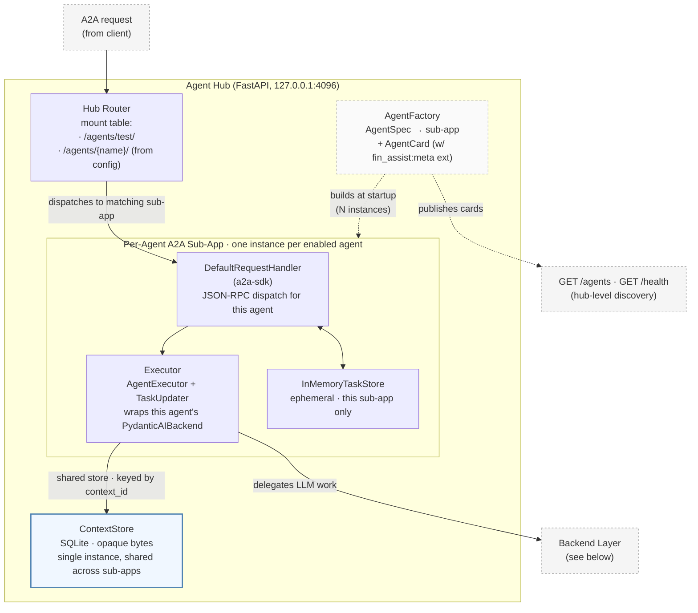
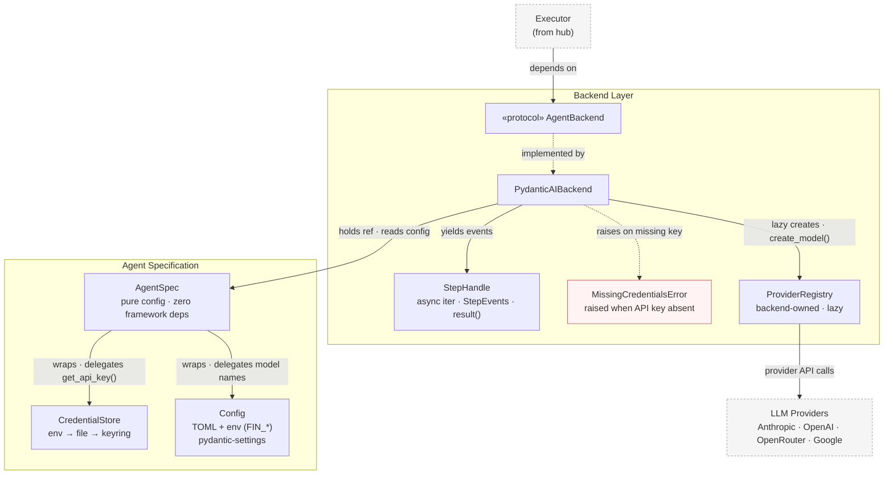
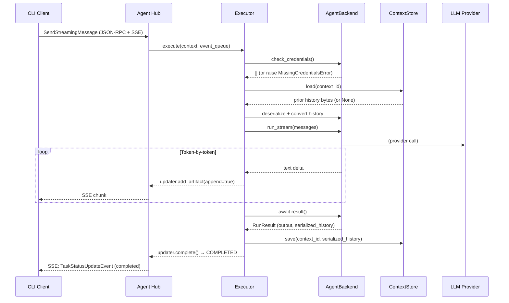

# Architecture

Developer reference for fin-assist's internals. For the user-facing pitch, see [`README.md`](../README.md). For deep dives, see the focused docs:

- [`configuration.md`](configuration.md) — TOML schema, file precedence, credentials
- [`skills.md`](skills.md) — skills lifecycle, tool gating, approval policies
- [`tracing.md`](tracing.md) — OTel instrumentation, HITL trace continuity, full instrumented request flow
- [`decisions.md`](decisions.md) — design decisions and open questions

## Vision

**Pluggable agentic experimentation platform.** fin-assist exposes shared agentic capabilities (tools, approval gates, context providers, observability) as framework-agnostic platform abstractions. Different LLM frameworks plug in via backend implementations. The platform owns the abstractions; backends adapt them. This mirrors the project's use of open protocols (A2A for transport, OTel for observability) — the platform defines the shape, backends fill in framework-specific details.

**Agent Hub.** A "turnstile" of specialized agents exposed via the [A2A protocol](https://google.github.io/A2A/) (via [a2a-sdk v1.0](https://github.com/a2aproject/a2a-python)). Each agent is independently discoverable, has its own agent card, and can be swapped in/out of the server. The hub handles routing, conversation persistence, and agent lifecycle.

**Dynamic UI via agent metadata.** Clients adapt their interface based on agent capabilities. Static metadata (multi-turn, thinking support, model selection) is declared in the A2A agent card via `AgentExtension`. Dynamic metadata (accept actions, rendering hints) is returned per-response in task artifacts. Clients don't need to know about specific agents — they read metadata and adapt.

**Protocol-native.** Built on A2A. Any A2A-compatible client can communicate with the hub. This enables future agent-to-agent workflows (e.g., SDD agent handing off to TDD agent).

**Hub as the deliverable; clients are protocol peers.** fin-assist ships one thing — the hub — and exposes it through standardized inbound protocol surfaces (A2A, MCP-server, ACP-server). Any conformant client (an editor, an MCP host, a future A2A peer) can drive the hub. The CLI is a development tool for hub system operations and a verification-only dev REPL, not an end-user product surface. See *Deliverables: Hub vs CLI* and *Inbound protocol surfaces* below.

## Deliverables: Hub vs CLI

fin-assist is structurally two pieces in one repository, separated by the A2A protocol — but only one of them is the **deliverable**:

| Piece | Role | Lives in | Talks to clients via |
|-------|------|----------|----------------------|
| **Agent Hub** | The deliverable. Platform server — hosts agents, routes traffic across inbound protocol surfaces, persists context | `src/fin_assist/hub/` | A2A (JSON-RPC + SSE) today; MCP-server and ACP-server committed |
| **Platform abstractions** | Shared infra consumed by hub + CLI — specs, backends, tools, skills, config, context, credentials, LLM registry | `src/fin_assist/agents/`, `config/`, `context/`, `credentials/`, `llm/`, `providers.py` | n/a (internal, not a networked service) |
| **CLI** | Development tool — hub system operations (`start`/`stop`/`status`/`/connect`/`fin pkg`) plus a verification-only dev REPL. Not an end-user product | `src/fin_assist/cli/` | Two transports against the hub: plain HTTP (`httpx`) for hub-level routes (`/health`, `/agents`, per-agent `/skills` and `/skills/invoke`) and process-lifecycle; A2A (`cli/client.py`, wrapping a2a-sdk) only for agent-traffic messaging in the dev REPL. `/connect` and `fin pkg` are local file I/O and never touch the hub |

These sibling packages sit alongside `hub/` and `cli/` in the flat namespace (`src/fin_assist/`), not nested under either piece. They are platform types consumed by both sides — the CLI imports `agents.metadata` and `config.loader`, the hub imports `agents.backend` and `agents.tools`. Nesting them under `hub/` would break the import firewall. The workspace split ([#128](https://github.com/ColeB1722/fin-assist/issues/128)) is deferred indefinitely (see [`decisions.md`](decisions.md)) — under the protocol-peer architecture there's no forcing function for it.

**The protocol is the contract.** The hub exposes itself to clients through fixed protocol surfaces (see *Inbound protocol surfaces* below). For agent-traffic messaging — the part of the dev REPL that exercises a hub agent — the CLI is one A2A consumer among many; it knows only the A2A wire format and the `fin_assist:meta` agent-card extension, never any hub internals. Hub system operations (`/health`, `/agents`, skill listing/invocation) ride plain HTTP routes the hub exposes for that purpose; these are not part of any inbound *protocol* surface, just the hub's own management API. End-user conversational use happens through the inbound protocol surfaces (MCP hosts, ACP editors, future A2A clients), not through the CLI.

## Inbound protocol surfaces

The hub exposes itself to external systems through protocol surfaces. Each surface is a fixed, externally-shaped contract — the hub adapts to the surface, not the other way around. Sibling protocols at different layers (agent ↔ agent, agent ↔ tool, client ↔ agent), not substitutes:

| Surface | Role | Status | Consumers / peers |
|---------|------|--------|-------------------|
| **A2A-server** | Agent ↔ agent. Each agent mounted as an A2A sub-app at `/agents/{name}/`. JSON-RPC + SSE. | Implemented. | CLI dev REPL today; future A2A peers (federation, [#80](https://github.com/ColeB1722/fin-assist/issues/80) second backend) |
| **MCP-server** | Hub exposes its agents as MCP tools to external hosts. | Architecturally committed; unmilestoned. Awaiting evidence from ACP-server. | Claude Desktop, Claude Code, opencode-as-host, Cursor — any MCP host |
| **ACP-server** | Hub speaks Agent Client Protocol so editors can drive fin agents. | First cut targeted at v0.1.3 ([#162](https://github.com/ColeB1722/fin-assist/issues/162)). Scope: session lifecycle, streaming text, permission round-trip. Edit visualization and full MCP-server forwarding deferred. | Zed (primary dogfooding client), JetBrains, Neovim (via Code Companion), VS Code (via `vscode-acp`) |

The hub also has **outbound** protocol surfaces it speaks as a client: MCP-client (implemented, v0.1.1 [#84](https://github.com/ColeB1722/fin-assist/issues/84)); A2A-client (v0.3 federation); ACP-client (architecturally committed; unmilestoned — plausible future home is v0.3, see [`decisions.md`](decisions.md)).

**Why ACP-server first.** Until a non-fin client drives the hub through a standardized protocol surface, the claim *"the protocol is the contract; new inbound consumers are protocol peers, not BFF clients"* is asserted rather than verified — the CLI controls both ends of its own A2A round-trip. ACP-server is the smallest realistic surface that produces this verification: the contract is fixed (Zed-led, Apache 2.0, well-documented), the hub has to fit, and bugs in the protocol-peer architecture surface as concrete client failures rather than design-doc speculation. The first cut is intentionally minimal; richer ACP features land later or never, depending on what the dogfooding loop reveals.

**Import-firewall rule.** Code in `hub/` must never import from `cli/`. Code in `cli/` must never import from `hub/` *for client purposes* — the only allowed direction is the in-process launcher path used by `fin-assist serve` (which loads `hub.app`/`logging`/`pidfile`/`tracing` to boot the FastAPI app in this process).

The rule is enforced by [`import-linter`](https://import-linter.readthedocs.io/) via two `forbidden` contracts in `pyproject.toml` under `[tool.importlinter]`. Run with `just lint-imports` (also part of `just ci`). The launcher allowlist is currently:

- `cli/main.py → hub.app` / `hub.logging` / `hub.pidfile` / `hub.tracing` — `_serve_command` boots the FastAPI hub in-process
- `cli/tracing.py → hub.file_exporter` — CLI-side spans share the hub's JSONL sink

Notably, `cli/server.py` (process-lifecycle: `start`/`stop`/`status`/`ensure_running`) is *not* on the allowlist — it spawns the hub as a subprocess via `httpx` + `Popen` and never imports `hub.*`. That cross-process boundary is the cleanest possible separation and should stay that way.

**New `cli/` code talking to the hub must go through `cli/client.py`** (the A2A client), not direct `hub.*` imports. If you legitimately need to extend the launcher path, add the specific `module -> module` line to `ignore_imports` in `pyproject.toml` with a justifying comment — don't weaken the contract itself.

**Why this matters now.** Today the boundary is already clean (hub has zero CLI imports; CLI's only hub imports are the two launcher files). Pinning the rule with `import-linter` prevents drift before a second client (TUI, future workspace-split — see [`decisions.md`](decisions.md)) makes the cost of drift concrete. When the workspace split lands ([#128](https://github.com/ColeB1722/fin-assist/issues/128)), the contracts become per-package and the launcher allowlist either disappears (launcher moves into the hub package) or shrinks to a single declared dependency edge.

## Design principles

1. **Config-driven agents** — Behavior (system prompt, output type, thinking, serving modes, approval, skills) lives in TOML, not Python subclasses. New agents are config entries, not new classes.
2. **Protocol-native** — A2A via a2a-sdk v1.0 for standardized agent communication. Multi-path routing: N agents, N agent cards, one server.
3. **Platform owns abstractions, backends adapt them** — Tools, approval, context, step events, tracing are framework-agnostic platform types in `agents/`. LLM frameworks plug in via backends that adapt platform concepts to their APIs. The platform never imports from backends.
4. **Local-first** — Server binds to `127.0.0.1` only; no network exposure by default. Local-first for iteration speed (fast feedback, no infra overhead), not as a permanent constraint. Remote topologies (Tailscale, remote workstation) are planned once the local experience is stable.
5. **Hub is the deliverable** — The hub is the platform; clients are protocol peers reached via standardized inbound surfaces (A2A, MCP-server, ACP-server). The CLI is a development tool, not an end-user product surface. See *Deliverables: Hub vs CLI* and *Inbound protocol surfaces* above.
6. **Metadata-driven clients** — Clients read agent capabilities from agent cards and adapt dynamically. No client-side agent-specific code.
7. **Protocol is the contract** — The hub and its clients communicate only through A2A + the `fin_assist:meta` extension. `cli/` does not import from `hub/` (except the in-process launcher path for `fin-assist serve`); `hub/` never imports from `cli/`. See *Deliverables: Hub vs CLI* above.

## Non-goals

- Network-accessible deployment (personal use only, local-first — remote topologies planned post-v0.2)
- Real-time command suggestions (on-demand only)
- A CLI that grows into an end-user conversational client. The CLI is a verification-only dev REPL plus hub system operations; end-user use happens through inbound protocol surfaces (see [`decisions.md`](decisions.md))
- TOML-based agent *creation* — agents are defined via TOML config, but `AgentSpec` is the only spec implementation. There is no `fin ingest` to create new agent classes from TOML.

## Maintenance contract

When a structural change lands, update the relevant doc(s) before the milestone closes — not necessarily in the same commit, but before the work is considered shipped. Design sketches live in `handoff.md` during development; once the shape stabilizes, the durable claims move here.

Any status claim ("integrated", "resolved", "implemented") must be **verifiable** — a reader who opens the referenced module should be able to confirm it. Use module-level references (`agents/backend.py`, `hub/executor.py`), not line numbers. Line numbers rot at this project's velocity and become false priors for agents consuming this doc as context. If a claim can't be verified without a specific line, it's too narrow to be a forever-doc claim — it belongs in a PR description or `handoff.md`.

## Hub internals

How requests are routed inside the hub process.



**Multi-path routing.** A2A maps 1:1 between a server and an agent card. To host N agents on one server, the parent FastAPI app mounts each agent's A2A sub-app at a unique path. Each sub-app has its own `DefaultRequestHandler`, `Executor`, and `InMemoryTaskStore`. The `ContextStore` is the only piece shared across sub-apps — context IDs are naturally scoped per-agent because tasks are sent to different A2A endpoints.

```text
Parent FastAPI App (127.0.0.1:4096)
├── GET  /agents                                    → discovery (list all agents)
├── GET  /health                                    → health check
└── Mount /agents/{name}/                           → AgentSpec([agents.<name>]) A2A sub-app
    ├── GET  /.well-known/agent-card.json           → agent card
    └── POST /                                      → JSON-RPC (SendMessage, GetTask, SendStreamingMessage)
```

## Backend layer

How the Executor reaches the LLM, and how config flows through the stack.

**Ownership chain:** `AgentFactory` constructs a `PydanticAIBackend(spec=agent_spec)`. The backend holds the spec as `self._spec` and reads all runtime config from it (system prompt, output type, thinking, tool policies, skill definitions, credential checks). The spec wraps `Config` and `CredentialStore` — the backend never touches them directly. When the backend needs an LLM model, it lazily creates its own `ProviderRegistry` and calls `spec.get_api_key()` / `spec.get_model_name()` to get provider-specific credentials and model names.



Arrow semantics: solid = direct dependency (calls, holds, yields to); dashed = implements or raises; edge labels clarify the relationship where the arrow direction alone is ambiguous.

**Spec/backend split.** fin-assist splits "what the agent is" from "how it runs":

- **`AgentSpec`** (`agents/spec.py`) — a pure configuration object. Zero framework imports. Wraps `Config` and `CredentialStore`; answers "what is this agent's system prompt?", "what's its output type?", "what metadata goes on its agent card?", "which providers have API keys?". The backend reads all runtime config through the spec and never touches `Config` or `CredentialStore` directly.
- **`AgentBackend`** (`agents/backend.py`) — a `Protocol` that says how to actually run a spec: stream output, convert A2A messages to framework messages, serialize history, check credentials. The only production implementation is `PydanticAIBackend`, which wraps `pydantic_ai.Agent` + `FallbackModel`.
- **`ProviderRegistry`** — not a shared service. Each `PydanticAIBackend` lazily creates its own `ProviderRegistry` the first time it builds a model. The registry translates `(provider_name, model_name, api_key)` into a pydantic-ai `Model` instance.

The `Executor` (`src/fin_assist/hub/executor.py`) depends on the `AgentBackend` protocol. `AgentSpec` is never imported by the executor — it flows through the backend. This isolates pydantic-ai to one file, so swapping LLM frameworks (or stubbing for tests) touches only `backend.py`.

> **Why no ABC on `AgentSpec`?** There is only one implementation. An ABC with a single impl is ceremony. If we ever need a type bound for DI/mocking, `typing.Protocol` supports structural subtyping without inheritance. A Rust/Gleam agent would not subclass a Python ABC — it would serve its own A2A endpoint over HTTP. The interop boundary is the A2A protocol, not Python inheritance.

## Key types

### `AgentSpec`

```python
class AgentSpec:
    """Pure config; zero framework deps."""

    def __init__(
        self,
        *,
        name: str,
        agent_config: AgentConfig,
        config: Config,
        credentials: CredentialStore,
    ) -> None: ...

    @property
    def name(self) -> str: ...
    @property
    def description(self) -> str: ...
    @property
    def system_prompt(self) -> str:        # via SYSTEM_PROMPTS registry
        ...
    @property
    def output_type(self) -> type[Any]:    # via OUTPUT_TYPES registry
        ...
    @property
    def thinking(self) -> Literal["off", "low", "medium", "high"] | None: ...
    @property
    def default_model(self) -> str: ...
    @property
    def agent_card_metadata(self) -> AgentCardMeta: ...
    @property
    def skill_tool_names(self) -> list[str]: ...   # union of tools across all skills

    def check_credentials(self) -> list[str]:
        """Names of enabled providers with missing API keys (empty = all present)."""
    def get_api_key(self, provider: str) -> str | None: ...
    def get_model_name(self, provider: str, default: str) -> str: ...
    def get_enabled_providers(self) -> list[str]: ...
```

### `AgentBackend`

```python
@runtime_checkable
class AgentBackend(Protocol):
    def check_credentials(self) -> list[str]: ...
    def convert_history(self, a2a_messages: Sequence[Any]) -> list[Any]: ...
    def run_steps(
        self,
        *,
        messages: list[Any],
        model: Any = None,
        deferred_tool_results: Any = None,
    ) -> StepHandle: ...
    def serialize_history(self, messages: list[Any]) -> bytes: ...
    def deserialize_history(self, data: bytes) -> list[Any]: ...
    def convert_result_to_part(self, result: Any) -> Part: ...
    def convert_response_parts(self, parts: Sequence[Any]) -> list[Part]: ...
    def build_deferred_results(self, decisions: list[ApprovalDecision]) -> Any: ...
    # Optional — backends may implement for framework-specific tracing
    def install_tracing(
        self,
        provider: TracerProvider,
        *,
        include_content: bool,
        event_mode: str,
    ) -> None: ...
```

`StepHandle` yields `StepEvent`s via async iteration — discriminated by `kind` (`text_delta`, `thinking_delta`, `tool_call`, `tool_result`, `step_start`, `step_end`, `deferred`) — and returns a `RunResult(output, serialized_history, new_message_parts)` from `result()`. The `tool_call`/`deferred` events drive HITL approval.

### `AgentCardMeta`

Static metadata declared by each agent and published in the A2A agent card as an extension. Clients read this to adapt their UI without knowing about specific agent types.

```python
ServingMode = Literal["do", "talk"]

class AgentCardMeta(BaseModel):
    """Static UI/capability metadata published in the agent card."""
    serving_modes: list[ServingMode] = ["do", "talk"]
    supports_thinking: bool = True
    supports_model_selection: bool = True
    supported_providers: list[str] | None = None    # None = all providers
    supported_context_types: list[str] = []
    color_scheme: str | None = None
    tags: list[str] = []
```

### Output type registry

Maps config names to Python types so TOML can reference types by name:

```python
OUTPUT_TYPES: dict[str, type] = {
    "text": str,
    "command": CommandResult,
}
```

### Prompt registry

Maps config names to prompt constants:

```python
SYSTEM_PROMPTS: dict[str, str] = {
    "chain-of-thought": CHAIN_OF_THOUGHT_INSTRUCTIONS,
    "shell": SHELL_INSTRUCTIONS,
    "test": TEST_INSTRUCTIONS,
    "git": GIT_INSTRUCTIONS,
    "git-commit": GIT_COMMIT_INSTRUCTIONS,
    "git-pr": GIT_PR_INSTRUCTIONS,
    "git-summarize": GIT_SUMMARIZE_INSTRUCTIONS,
}
```

### Tool and context registries

Both tools and context providers use a **provider-protocol pattern**: a registry aggregates contributed items from one or more providers, rather than hardcoding them.

#### `ToolProvider` + `ToolRegistry`

```python
class ToolProvider(Protocol):
    @property
    def name(self) -> str: ...
    def discover(self) -> list[ToolDefinition]: ...

class ToolRegistry:
    def add_provider(self, provider: ToolProvider) -> None: ...
    def get(self, name: str) -> ToolDefinition | None: ...
    def get_for_agent(self, tool_names: list[str]) -> list[ToolDefinition]: ...
```

`BuiltinToolProvider` contributes the five built-in tools (`read_file`, `git`, `gh`, `shell_history`, `run_shell`). Future providers (`MCPToolProvider`, `FileToolProvider`) plug into the same registry.

#### `ContextProvider` + `ContextProviderRegistry`

```python
class ContextProvider(ABC):
    @abstractmethod
    def search(self, query: str) -> list[ContextItem]: ...
    @abstractmethod
    def get_item(self, id: str) -> ContextItem: ...
    @abstractmethod
    def get_all(self) -> list[ContextItem]: ...
    @abstractmethod
    def _supported_types(self) -> set[ContextType]: ...

class ContextProviderRegistry:
    def register(self, provider: ContextProvider) -> None: ...
    def get_by_type(self, context_type: ContextType) -> ContextProvider | None: ...
```

The registry enforces **one provider per context type** (`file`, `git_diff`, `git_log`, `git_status`, `history`, `env`). Built-in providers are registered via `create_default_context_registry()`. The CLI's `@`-resolution and tool callables both route through this registry, eliminating the previous split-brain problem where `@`-completion and tool calls created separate provider instances.

Context gathering works two ways, both through the registry:

- **Model-driven** — `ContextProvider`s are wired as tools via `ToolRegistry`, so the agent can request context during execution.
- **User-driven** — `@`-completion in `FinPrompt` resolves via `ContextProviderRegistry` before sending (`@file:path`, `@git:diff`, `@history:query`, `@env:VAR`).

## Hub factory

`create_hub_app()` takes a pre-built sequence of `AgentSpec`s (constructed by the caller, e.g. `_serve_command` in `cli/main.py`), builds the parent FastAPI app, constructs a single shared `ContextStore`, and mounts one sub-app per spec via `AgentFactory`:

```python
def create_hub_app(
    agents: Sequence[AgentSpec] | None = None,
    db_path: str = ":memory:",
    base_url: str = "http://127.0.0.1:4096",
    backend_factory: Callable[[AgentSpec], AgentBackend] | None = None,
    context_settings: ContextSettings | None = None,
) -> FastAPI:
    app = FastAPI(title="fin-assist Agent Hub")
    context_store = ContextStore(db_path=db_path)          # shared across sub-apps
    factory = AgentFactory(
        context_store=context_store,
        context_settings=context_settings,
    )

    for spec in agents or []:
        sub_app = factory.create_a2a_app(
            spec,
            base_url=base_url,
            backend=backend_factory(spec) if backend_factory else None,
        )
        app.mount(f"/agents/{spec.name}", sub_app)

    @app.get("/agents")
    async def discovery(): ...     # returns each agent's name, description, card URL, card_meta

    @app.get("/health")
    async def health(): ...

    return app
```

The split between "build specs" (in the CLI command) and "mount specs" (in the factory) lets the caller wire backends, tracing, and tool registries before the app exists — see `cli/main.py:_serve_command` for the full ordering (specs → backends → `setup_tracing` → `create_hub_app` → `FastAPIInstrumentor`).

`AgentFactory.create_a2a_app(spec, ...)` builds the agent card with an `AgentExtension(uri="fin_assist:meta")` carrying `AgentCardMeta`, constructs (or accepts) a `PydanticAIBackend` wrapping the spec, builds an `Executor` consuming the backend, creates a per-sub-app `InMemoryTaskStore`, mounts a `POST /skills/invoke` route for the skill-loading A2A method extension, and wires through `DefaultRequestHandler`. The result is a FastAPI sub-app with the a2a-sdk JSON-RPC + agent-card routes mounted.

## Request flow overview

Structural overview of a `SendStreamingMessage` call. The fully instrumented version with tracing spans, HITL pause/resume, and approval flow lives in [`tracing.md`](tracing.md#instrumented-request-flow).



## A2A protocol integration

A2A is an open protocol (originated by Google) for standardized agent communication. **a2a-sdk v1.0** is Google's official Python SDK, supporting JSON-RPC, REST, and gRPC transports from a single protobuf schema.

Key benefits for fin-assist:

- **Standardized interface** — any A2A-compatible client can talk to the server
- **Agent discovery** — Agent Cards at `/.well-known/agent-card.json` per agent
- **Task lifecycle** — built-in task state management (submitted, working, completed, failed, auth-required, canceled)
- **Conversation context** — `context_id` links multi-turn conversations across tasks
- **Structured artifacts** — pydantic models become protobuf `Part(data=...)` artifacts with JSON schema metadata
- **Streaming** — `SendStreamingMessage` method delivers token-by-token SSE output
- **Auth-required state** — first-class `TaskState.TASK_STATE_AUTH_REQUIRED` for credential-gated agents

### a2a-sdk v1.0 components

- **`DefaultRequestHandler`** — routes JSON-RPC methods to the executor.
- **`Executor`** — implements `AgentExecutor` with `execute()` and `cancel()`. Framework-agnostic: depends on the `AgentBackend` protocol. Owns streaming loop, auth-required detection, and context persistence.
- **`TaskUpdater`** — SDK helper for state transitions (`start_work`, `complete`, `failed`, `requires_auth`, `add_artifact`).
- **`InMemoryTaskStore`** — ephemeral task storage managed by the SDK (tasks are lost on server restart).
- **`ContextStore`** — fin-assist's own SQLite-backed store for pydantic-ai conversation history, persisted across tasks within a conversation.
- **`AgentExtension`** — publishes `AgentCardMeta` as a proper extension (`uri="fin_assist:meta"`) in the agent card's capabilities.

### Transport

The A2A protocol defines transport as pluggable. a2a-sdk v1.0 supports JSON-RPC, REST, and gRPC transports from the same protobuf schema. fin-assist uses the SDK's JSON-RPC transport via the `Client.send_message(SendMessageRequest(...))` API (`cli/client.py`); request/response wire formats and method dispatch are handled inside a2a-sdk.

| Modality | Transport | Status | Notes |
|----------|-----------|--------|-------|
| Blocking message | JSON-RPC | Implemented | Hub responds inline when agent finishes |
| Streaming | JSON-RPC SSE | Implemented | Token-by-token via `TaskUpdater.add_artifact(append=True)` |
| Non-blocking + polling | JSON-RPC | Future | Not yet wired |
| gRPC | gRPC | Future | Protocol-native; a2a-sdk v1.0 supports it |

## CLI entry points

The CLI is a development tool (see *Deliverables: Hub vs CLI*). It has two responsibilities: hub system operations and a verification-only dev REPL. The entry points below reflect the **current implementation**; the verification-only contraction (per [`decisions.md`](decisions.md)) is in-flight — `--edit`, the `fin do` vs `fin prompt` split, and richer REPL UX features will drop as v0.1.3 ([#137](https://github.com/ColeB1722/fin-assist/issues/137), [#162](https://github.com/ColeB1722/fin-assist/issues/162)) and the v0.2.1 split execute. Treat the list as the current surface, not the target surface.

```text
fin-assist serve                            → start agent hub in foreground on 127.0.0.1:4096
fin-assist start | stop | status            → background hub lifecycle
fin-assist agents                           → list available agents (GET /agents)
fin-assist do "prompt"                      → one-shot to default_agent from config
fin-assist do --agent <name> "prompt"       → one-shot to named agent
fin-assist do --agent <name> --skill <name> → one-shot with a skill pre-loaded
fin-assist do --agent <name> <skill>        → prompt-as-skill: prompt is auto-promoted
                                              to the skill name when it matches one
fin-assist do --edit "prompt"               → open input panel pre-filled with prompt
fin-assist do                               → no prompt → opens input panel
fin-assist talk [--agent <n>] [--skill <n>] → multi-turn session
fin-assist talk --resume <id>               → resume a saved session
fin-assist talk --list                      → list saved sessions for agent
fin-assist list tools|skills|prompts|output-types  → list registry entries
```

> Note: the `--agent` flag is required when you want a non-default agent. There is no bare positional `fin do <agent> <skill>` form — the `do` parser has only one positional argument (`prompt`). What works is the *prompt-as-skill* shortcut: `fin do --agent git commit` is parsed as `prompt="commit"` and then auto-promoted to `skill=commit` because `commit` is a registered skill on `git`.

REPL commands (during multi-turn chat):

```text
/skills          list available skills for the current agent
/skill:<name>    load a skill mid-session (e.g. /skill:commit)
/exit            end the conversation
/help            show available commands
```

Context injection: `@`-completion in `FinPrompt` (e.g. `@file:path`, `@git:diff`) injects context into prompts before sending.

**Server lifecycle.** `fin-assist serve` starts the hub standalone; `fin-assist do/talk/agents` auto-start the server if it's not running.

## UI metadata flow

```text
Static (discovery time):                    Dynamic (per-response):
┌──────────────────────┐                    ┌──────────────────────────┐
│ Agent Card            │                    │ Task Artifact             │
│ /.well-known/         │                    │ (returned with each      │
│  agent-card.json      │                    │  task completion)        │
│                       │                    │                          │
│ • name, description  │                    │ • result data            │
│ • skills[]           │                    │ • metadata: {            │
│ • extensions: [      │                    │     accept_action: ...,  │
│   {uri: "fin_assist:│                    │     suggested_next: ..., │
│    meta", params: {  │                    │   }                      │
│       serving_modes, │                    │                          │
│       thinking,      │                    └──────────────────────────┘
│       model_select,  │
│       color_scheme,  │
│       supported_     │
│       context_types  │
│     }                │
│   }                  │
└──────────────────────┘
```

## Local-only security

The server binds to `127.0.0.1` by default — only local processes can communicate with agents. This is intentional: fin-assist is designed for personal use on a trusted machine. The local-only default is an iteration-speed choice, not a permanent limitation. Remote deployment topologies (Tailscale tunneling, remote workstations) are planned once the local experience stabilizes. When remote topologies land, the workspace split ([#128](https://github.com/ColeB1722/fin-assist/issues/128)) makes deployment boundaries explicit in the package structure.

## See also

- [`docs/configuration.md`](configuration.md) — TOML schema, file precedence, credentials
- [`docs/skills.md`](skills.md) — skills lifecycle, tool gating, approval policies
- [`docs/tracing.md`](tracing.md) — OTel instrumentation, HITL trace continuity
- [`docs/decisions.md`](decisions.md) — design decisions and open questions
- [`AGENTS.md`](../AGENTS.md) — development workflow, conventions, skill authoring
