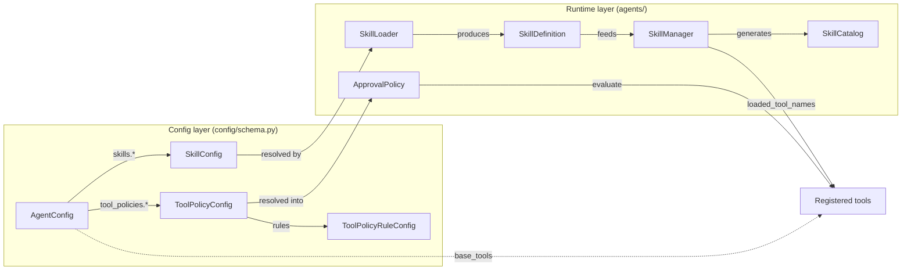

# Skills

A fin-assist agent is a collection of **skills** within an environment (system prompt). A skill curates tools, context injection text, and prompt steering. Skills are the primary mechanism for organizing agent behavior — tools attach through skills, and tools are only registered when their skill is loaded.

Approval policies are defined at the **agent level** via `tool_policies`, not per-skill. This eliminates merge conflicts when multiple skills reference the same tool.

## Key types



| Type | Location | Purpose |
|------|----------|---------|
| `SkillDefinition` | `agents/skills.py` | Runtime representation of a resolved skill |
| `SkillCatalog` | `agents/skills.py` | Generates catalog text for the system prompt |
| `SkillLoader` | `agents/skills.py` | Resolves `SkillConfig` or SKILL.md files into `SkillDefinition` instances |
| `SkillManager` | `agents/skills.py` | Tracks loaded skills, provides `load_skill` callable, `loaded_tool_names()`, generates catalog |
| `SkillConfig` | `config/schema.py` | Per-skill TOML config (tools, prompt_template, entry_prompt, context, serving_modes) |
| `ToolPolicyConfig` | `config/schema.py` | Agent-level tool approval policy (default mode + rules) |
| `ToolPolicyRuleConfig` | `config/schema.py` | Single fnmatch-based approval rule in config |
| `ApprovalPolicy` | `agents/tools.py` | Runtime policy: `evaluate(args) -> tuple[mode, description]` (first-match rules, default fallback) |
| `AgentConfig.base_tools` | `config/schema.py` | Always-available tools (default: `[]`; agents opt in via config or skills) |
| `AgentConfig.tool_policies` | `config/schema.py` | Agent-level tool approval policies (dict keyed by tool name) |

## Skill lifecycle

1. **Config time** — Skills are defined in `config.toml` under `[agents.<name>.skills.<skill>]`. SKILL.md files (under `$FIN_DATA_DIR/skills/<name>/SKILL.md`) are discoverable today via `fin list skills` but are **not loaded into running agents** — the runtime `SkillManager` is built only from inline TOML config (`AgentSpec.get_skill_definitions()` calls only `loader.load_all_from_agent_config`). Wiring SKILL.md files into the runtime, plus a real project-vs-user precedence model and the cross-agent binding question, is tracked as [#125](https://github.com/ColeB1722/fin-assist/issues/125). Tool approval policies are defined at the agent level under `[agents.<name>.tool_policies.<tool>]`.
2. **Agent startup** — `SkillLoader` resolves the inline-config skills into `SkillDefinition` instances. `AgentSpec.skill_tool_names` derives from the union of all skill tool lists. `AgentSpec.base_tools` lists always-available tools.
3. **Backend init** — `PydanticAIBackend._get_skill_manager()` creates a `SkillManager` from the spec's skill definitions. Only `base_tools` are registered initially. If any skills are available but not yet loaded, the `load_skill` tool is registered and the skill catalog is appended to the system prompt.
4. **Skill loading** — Skills can be loaded via:
   - `--skill` CLI flag or positional syntax (`fin do git commit`) — calls the `skills/invoke` endpoint server-side
   - `/skill:<name>` in the REPL
   - Agent-driven `load_skill` tool call

   All paths call `SkillManager.load_skill()` which marks the skill as loaded.
5. **Tool gating** — `_build_pydantic_agent()` registers only `base_tools` + `SkillManager.loaded_tool_names()`. Skills that aren't loaded have their tools excluded from the agent. `_build_pydantic_agent()` is called on every `step()`, so loading takes effect on the next turn.
6. **Agent-level policies** — `_get_agent_tool_policy()` resolves `AgentConfig.tool_policies` into `ApprovalPolicy` instances. Each tool has exactly one policy.

## Tool gating

The key behavior: **tools are not all registered up front**. `_build_pydantic_agent()` registers only:

- `base_tools` (always available, default `[]`)
- `SkillManager.loaded_tool_names()` (tools from loaded skills)

The LLM can only use tools from loaded skills. Unloaded skills' tools simply don't exist from the agent's perspective — skill boundaries are enforced, not advisory.

## Agent-level tool policies

Instead of per-skill `approval` blocks (which duplicated rules across skills), policies live at the agent level keyed by tool name:

```toml
[agents.git]
system_prompt = "git"
output_type = "text"
base_tools = ["read_file"]

[agents.git.tool_policies.git]
default = "always"
rules = [
  { pattern = "git diff*",   mode = "never" },
  { pattern = "git status*", mode = "never" },
  { pattern = "git log*",    mode = "never" },
  { pattern = "git add*",    mode = "never" },
  { pattern = "git commit*", mode = "never" },
]

[agents.git.tool_policies.gh]
default = "always"
rules = [
  { pattern = "gh pr view*", mode = "never" },
  { pattern = "gh pr list*", mode = "never" },
]
```

Each tool has exactly one policy definition — no merging, no conflicts.

## Approval rules

Rules use fnmatch patterns matched against the tool's args string. `ApprovalPolicy.evaluate(args)` checks rules in first-match order; if no rule matches, `default` applies.

This is conservative in v0.1: if `default="always"` or any rule has `mode="always"`, the tool gets `requires_approval=True` at registration time. Fine-grained per-subcommand evaluation at the executor level is planned for v0.1.1.

## skills/invoke endpoint

`POST /agents/{name}/skills/invoke` (A2A Method Extension) is the primary server-side skill entry point. It:

1. Validates the skill name against the agent's config
2. Calls `SkillManager.load_skill()` to mark the skill as loaded
3. Returns the effective prompt, prompt_template, and tools for the loaded skill

The CLI calls this endpoint before streaming when a skill is resolved via `--skill` or positional syntax. The REPL's `/skill:<name>` command also calls this endpoint.

## REPL skill commands

- `/skills` — Lists available skills for the current agent (calls `GET /agents/{name}/skills`)
- `/skill:<name>` — Loads a skill mid-session (calls `POST /agents/{name}/skills/invoke`), e.g. `/skill:commit`
- `SkillCompleter` provides fuzzy completion after `/skill:`, using rapidfuzz `fuzz.WRatio` (same scorer and pattern as `AtCompleter` for `@file:`)

## Skill tracing

Today, only one piece of skill activity is observable in traces:

- **CLI-side**: `cli_root_span(skill="commit")` stamps `fin_assist.cli.skill` on the CLI root span when a skill is pre-loaded via `--skill` flag or the prompt-as-skill shortcut.

Two further hooks exist as scaffolding but are **not yet invoked** — tracked as [#123](https://github.com/ColeB1722/fin-assist/issues/123):

- `_TaskTracer.emit_skill_load_span()` (defined; would emit `fin_assist.skill_load` with `fin_assist.skill.id`, `fin_assist.skill.entry_point`, `fin_assist.skill.tools_unlocked`) — would fire when a skill loads during a task.
- `start_task_span(skill_id=...)` (parameter accepted; would stamp `fin_assist.skill.id` on the `fin_assist.task` span) — would fire when a skill was pre-loaded before the task started.

See [`docs/tracing.md`](tracing.md) for the broader tracing model.

## SKILL.md format

SKILL.md files follow the [agentskills.io](https://agentskills.io) open standard: YAML frontmatter between `---` delimiters + markdown body. fin-assist extensions live under `metadata.fin-assist.*`:

```markdown
---
name: commit
description: Generate a conventional commit message.
allowed-tools:
  - git
  - read_file
metadata:
  fin-assist:
    prompt-template: git-commit
    entry-prompt: Analyze the current changes and generate a commit message.
---
## Guidelines for commit messages

Use conventional commits format. Keep the subject line under 50 characters.
```

Discovery paths (used by `fin list skills` only — see lifecycle note above; runtime loading is tracked as [#125](https://github.com/ColeB1722/fin-assist/issues/125)):

- `$FIN_DATA_DIR/skills/<name>/SKILL.md` (with `FIN_DATA_DIR=./.fin` for project-local skills in dev)
- `~/.config/fin/skills/<name>/SKILL.md` (user)

## Inline TOML skills

For skills with light context, define them inline in `config.toml`:

```toml
[agents.git]
base_tools = ["read_file"]

[agents.git.skills.commit]
description = "Generate a conventional commit message from current changes."
tools = ["git"]
prompt_template = "git-commit"
entry_prompt = "Analyze the current staged and unstaged changes and generate a conventional commit message."
```

CLI usage:

- `fin do git commit` → agent=git, skill=commit (entry_prompt sent as user message, prompt_template injected as context)
- `fin do git --skill commit` → same, explicit skill flag
- `fin do git` → agent=git, no skill (LLM routes based on user input, may call `load_skill` from catalog)

## Adding a new skill

1. Add the skill to `config.toml` under the appropriate agent (or create `.fin/skills/<name>/SKILL.md`).
2. If the skill needs a new tool, add it to `create_default_registry()` in `agents/tools.py`.
3. Write tests in `tests/test_agents/test_skills.py` (loader, catalog, manager).
4. Run `just ci` to verify.
5. Update this doc if the skill introduces new patterns.

## Design decisions

| Decision | Choice | Rationale |
|----------|--------|-----------|
| Skills are additive | No unloading in v0.1 | Simplicity; once tools are registered, removal is complex |
| Tools shared across skills | Name collisions = config error | Single tool registry; same tool name must map to same callable |
| Tool gating by loaded skills | `base_tools` + `loaded_tool_names()` only | Makes skill boundaries meaningful; LLM can't use unloaded tools |
| Agent-level tool policies | `tool_policies` on `AgentConfig`, not per-skill | Each tool has exactly one policy — no merge/conflict |
| `base_tools` default `[]` | No tools implied; agents opt in | Tool availability is explicit — no hidden dependencies on implicit defaults |
| Agent-driven + CLI skill loading | `load_skill` tool + `skills/invoke` endpoint + `--skill` flag | Multiple entry points for different workflows |
| `/skill:<name>` REPL pattern | Mirrors `@file:` pattern with `SkillCompleter` | Consistent UX; fuzzy completion via rapidfuzz |
| SKILL.md follows agentskills.io | Standard format with `metadata.fin-assist.*` extensions | Interoperability with other agent platforms |
| Skill tracing via OTel | `fin_assist.skill_load` span + `fin_assist.cli.skill` attribute | Observable skill activations in Phoenix/traces.jsonl |

## Roadmap

| Version | Feature |
|---------|---------|
| v0.1.1 | MCP tool source — `MCPToolset` registers discovered tools into `ToolRegistry` |
| v0.1.1 | Pluggable base system prompts — user-overridable prompt templates, not hardcoded Python constants |
| v0.1.1 | Per-subcommand approval evaluation at executor level |
| v0.1.1 | Registry consistency + policy resolution audit |
| v0.2 | Skill composability (skills invoking skills) + agent-to-agent orchestration |
| v0.3 | Eval harness |
