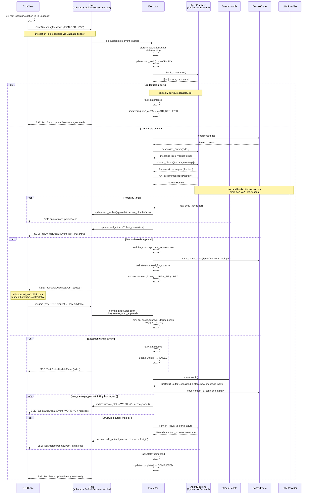

# Tracing & Observability

fin-assist emits OpenTelemetry spans across two processes — the CLI and the hub — and joins them so one `fin` invocation reads as one browsable flow in Phoenix (or any OTLP-compatible backend).

## Trace topology

```text
CLI process                                Hub process
━━━━━━━━━━━                                ━━━━━━━━━━━
cli.do  (root, one per invocation)
│   fin_assist.cli.invocation_id = <uuid>  (also in Baggage)
│   fin_assist.cli.command = "do"
│
├── GET  /health                     ────► (hub: request span)
├── GET  /agents                     ────► (hub: request span)
├── GET  /agents/<name>              ────► (hub: request span)
└── POST /agents/<name>/:send-msg    ────► POST /agents/<name>/:send-message
                                              │
                                              └── fin_assist.task
                                                  fin_assist.cli.invocation_id = <uuid>  ← join key
                                                  fin_assist.task.state = running|completed|failed|paused_for_approval
                                                  ├── fin_assist.step
                                                  │   ├── fin_assist.tool_execution
                                                  │   └── running tool          (pydantic-ai)
                                                  └── (LLM spans: gen_ai.*, llm.*)
```

**Why one CLI trace + one hub trace, not one shared `trace_id`:** HTTP boundaries already open fresh traces hub-side; making them share a `trace_id` would require suppressing the hub's natural request tracing, which would also suppress useful per-request timing data. Instead we join via `fin_assist.cli.invocation_id` (Baggage-propagated) — a single attribute lookup in Phoenix shows all spans across both processes for one invocation.

## Instrumented request flow

Full sequence diagram of a `SendStreamingMessage` call, with span emissions and state transitions called out. The structural overview without spans lives in [`docs/architecture.md`](architecture.md#request-flow-overview).



## HITL pause/resume

Tool calls requiring human approval pause the hub task (`requires_input`) and the CLI waits for the user's y/N. The resume opens a **new** HTTP request → new hub trace → new `fin_assist.task` span. Continuity across the pause:

1. At pause, the hub executor emits `fin_assist.approval_request` (a zero-duration span — OTel spans cannot be reopened across processes, so the "wait" is represented implicitly by the time-gap between this span's end and the resumed trace's start).
2. The executor persists the paused span's `SpanContext` + original `user_input` via `ContextStore.save_pause_state`.
3. At resume, the new task span carries a `Link(resume_from_approval)` back to the paused `approval_request` span, and emits `fin_assist.approval_decided` as its first child with a second `Link(approval_for)` to the same target.
4. The CLI root span stays open across the approval wait (no 30-min timeout today — tracked as follow-up), and wraps the y/N prompt in a `cli.approval_wait` child so dashboards can subtract human think-time.

In Phoenix the two hub traces appear as siblings, joined by the Link (rendered as "jump to related trace") and by the shared `fin_assist.cli.invocation_id` attribute. The CLI trace is a third sibling that contains both hub traces as link targets via its child HTTP spans.

## Task state attribute

`fin_assist.task.state` (`running` → `completed` / `failed` / `paused_for_approval`) is the canonical Phoenix filter for task-level queries. One attribute with a small enum keeps queries simple — one equality check per state instead of a compound predicate across several booleans.

## Skill spans

Skill activations are observable:

- **CLI-side**: `cli_root_span(skill="commit")` stamps `fin_assist.cli.skill` on the CLI root span when a skill is pre-loaded via `--skill` flag or positional syntax
- **Hub-side**: `fin_assist.skill_load` span emitted via `_TaskTracer.emit_skill_load_span()` when a skill is loaded during a task (agent-driven `load_skill` tool). Carries `fin_assist.skill.id`, `fin_assist.skill.entry_point`, `fin_assist.skill.tools_unlocked`
- **Task span**: `start_task_span(skill_id="commit")` stamps `fin_assist.skill.id` on the task span when the skill was pre-loaded before the task started

## Noise suppression

Two upstream instrumentors were disabled because they produce high-volume, low-value spans:

- **a2a-sdk**'s `@trace_class` decorator wraps every internal queue / task-store method with a `SpanKind.SERVER` span. Disabled via `OTEL_INSTRUMENTATION_A2A_SDK_ENABLED=false` (vendor-supported env off-switch, set by `setup_tracing` via `os.environ.setdefault` so operators can re-enable for debugging).
- **FastAPIInstrumentor**'s per-SSE-chunk `http.response.body` span. Dropped in the export pipeline by `_DropSpansProcessor` (key on `asgi.event.type = "http.response.body"`, not on span name, so instrumentor-version renames don't break us).

## Attribute hygiene

Three classes of leaked/duplicate attributes are scrubbed at `on_end` before export:

- `logfire.*` — pydantic-ai uses logfire as its internal tracing front-end; the `logfire.msg` / `logfire.json_schema` attrs ride along with no value for downstream consumers.
- `final_result` on `agent run` spans — already duplicated as `output.value` (OpenInference) and `pydantic_ai.all_messages`. Dropping saves ~5–30KB per trace.
- Duplicate `session.id` when identical to `fin_assist.context.id`.

## Files

- `src/fin_assist/hub/tracing.py` — vendor-agnostic TracerProvider builder (OTLP + JSONL file sink, plus drop + truncate + scrub processors)
- `src/fin_assist/hub/tracing_attrs.py` — centralized attribute names and enum values (`FinAssistAttributes`, `TaskStateValues`, `SpanNames`)
- `src/fin_assist/cli/tracing.py` — CLI-side tracer; `cli_root_span` / `approval_wait_span` context managers + `HTTPXClientInstrumentor` integration
- `src/fin_assist/agents/pydantic_ai_tracing.py` — pydantic-ai → OpenInference bridge (the one place that imports `openinference.instrumentation.pydantic_ai`; kept isolated so the hub stays framework-neutral)

## Local trace inspection

Tracing is enabled by default in dev (`FIN_TRACING__ENABLED=true` in `devenv.nix`). Spans are written to:

- **Phoenix** if running at `localhost:6006` (rich UI for trace exploration)
- **`./.fin/traces.jsonl`** always — line-delimited JSON for grep/jq inspection without a UI
